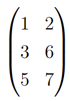

# Forall-Exist Statements & Fair Allocation problems

This project has **two different purposes**:

1. **Solve a forall exist statement**: Given a matrix $( W \in \mathbb{Z}^{m 	\times n} )$ and a polyhedron $( Q \subseteq \mathbb{R}^m )$, decide the validity of the statement:
   $$\forall b \in Q \cap \mathbb{Z}^m,  \exists x \in \mathbb{Z}^n 	\text{ such that } Wx \leq b$$

2. **Solve a Fair Allocation problem**: For $n$ agents and $m$ object categories, determine whether a **fair allocation** exists, and if so, compute it.

---

## Requirements

- **Gurobi** optimizer (make sure it's installed and accessible with a valid license)
- C++ compiler (e.g., `g++`, `clang++`)

---
## Running code
If you want to directy run the program, you can simply use the compiled `.exe` file. Navigate to the `src` folder and run the following command depending on the problem you want to solve:
### Case 1: Forall–Exist Verification
 
```sh
Forall-exist.exe  0 m n W_values... nbQ Q_values...
```
More precisely:

1. The first  0 indicates that you chose the first type of problem.
2.  `m` and `n` are the dimension of your matrix.
3. `W_values` are the entries of your matrix as follows  
 Example: the following matrix   
   will be written in the following way
```cpp
    1 2  3 6  5 7
```

4. `nb_Q` specify the number of inequalities defining $Q$, and an inequality is of the following form:

```
  c a₁ a₂ ... aₙ  
``` 
and it corresponds to the inequality:

$a_1 x_1 + a_2 x_2 + \dots + a_n x_n + c \geq 0$

---

Here is a small example to start with: 

```sh
Forall-exist.exe 0   2 1   1 2   1   1 -1 0
```
which represent a column matrix $W$ with coefficients $W(1,1)=2$ and $W(1,2)=2$ and $Q$ is defined by one inequality : $1-x\geq 0$.
## Case 2: Fair Allocation

```sh
Forall-exist.exe 1 nb_agent nb_object N_values... Utility_values...
```
More precisely: 

1. The first  1 indicates that you chose the first type of problem.
2. `nb_agent` and `nb_object` speak for themselves.
3. `N_values` are the $N(i)$ written as follows:
```
  a₁ a₂ ... aₘ  
```
Example :  1 2 3 4 5 describe a problem in which you have one item for the first category, two for the second one and so on.

4. Utility_values written as follows : the first m values are defining the utility function for the first agent: 
```
  a₁ a₂ ... aₘ  
```
Here is a small example to start with: 

```sh
Forall-exist.exe 1 2 2  1 1  1000 0 0 1000
```
which represent a fair allocation problem with two agents and two object categories (1 per categories). The first agent has a utility of a 1000 for the first object and 0 for the second one and the second agent has a utility of a 1000 for the second object and 0 for the first one.

---

## Structure
### Code
Everything related to code is in the `src` folder. This includes `.cpp` files and their headers as well as the compiled exectutable scripts.

The script `Forall-exist.exe` enables to deploy the tools we developed in the project to solve both a fair allocation and forall-exists statement.

### Docs
The images used in the readme are in the `images` folder.

## Compiling C++ code
If you need to modify the code or re-compile it for some reason, you can navigate to the `src` folder and run something along the line.

```sh
cl /EHsc /MD /std:c++17 /Iheaders /I"C:\gurobi1103\win64\include" /I"C:\Libraries\eigen-3.4.0" cpp\Forall_Exist.cpp cpp\Construction_Allocation.cpp cpp\Construction_Part_1.cpp cpp\Solve_6.cpp cpp\Useful_fct.cpp C:\gurobi1103\win64\lib\gurobi110.lib C:\gurobi1103\win64\lib\gurobi_c++md2017.lib /FeForall-exist.exe && Forall-exist.exe
```
## 📎 Notes

- The code leverages Gurobi for solving ILPs; make sure your environment is correctly configured.
- On windows, you might want to run the command on a `x64 Native Tools Command Prompt` to be able to run `cl`.*